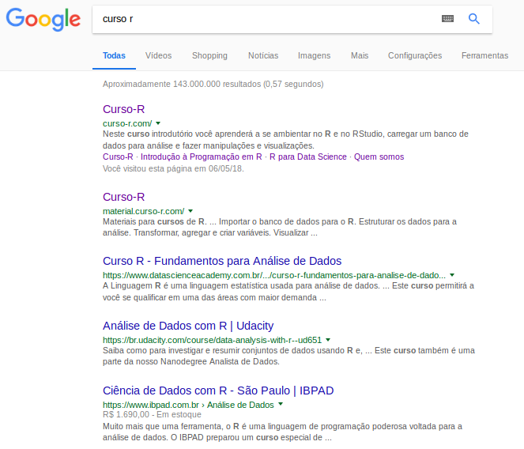

```{r setup, include=FALSE}
options(htmltools.dir.version = FALSE)
```

## Curso-R

<br>

</img>

---

## Professores

</img>

---

# Programa do curso

- 22/10 (seg) - **Introdução ao Machine Learning e ambientação ao R e RStudio**

- 24/10 (qua) - **Estratégias gerais: separação da base de dados, reamostragem, tuning de modelos, métricas de performance**

- 29/10 (seg) - **Regressão linear, regularização**

- 31/10 (qua) - **Regressão logística, regressão vs classificação**

- 05/11 (seg) - **Modelos de árvores**

- 07/11 (qua) - **Bagging, Boosting e cases**

- 08/11 (qui) - **Cases**

---

## Dinâmica das aulas

* Aulas expositivas com exercícios ao decorrer e ao final das aulas.

* Parada para café às 20h30.

---

# Ciência de dados


---

## Material

* Temos um material em português disponível nesta página:

<center><a href = 'http://material.curso-r.com/'>http://material.curso-r.com/ </a></center>

</img>

---

class: middle, center, inverse

# Introdução

---

# O que é Machine Learning?

<br>

--

- Não é um termo novo: criado por Arthur Samuel, em 1959


--

- Existe um grande hype atualmente em cima desse termo (~50 artigos por dia no Arxiv!!!)

--


--

- Machine Learning é um nome marketeiro para modelagem preditiva

--

- Modelagem preditiva é um framework de análise de dados que visa gerar a estimativa mais precisa possível para uma quantidade ou fenômeno (Max Kuhn, 2014).


---

# Por que o hype?

- Poderio computacional

- Disponibilidade de dados

- Sucesso em resolver problemas historicamente difíceis

---

## Exemplos


--


--


--


--


--


--


---

class: middle, center, inverse

# Relação com a Estatística

---

# Machine Learning e Estatística


--

1) Gostaríamos de saber como $x$ e $y$ estão relacionadas.

--

2) Gostaríamos de prever $y$ a partir de $x$.

--

<br>

Matematicamente, queremos encontrar uma função $f()$ tal que:

$$
y \approx f(x)
$$

---

# Machine Learning e Estatística

  
 
--

<br>
<br>
 
 

---

class: middle, center, inverse

# Habilidades

---

# Pensamento crítico

<br>
<br>
<br>

- Entender o problema

- Manter foco no objetivo

- Definir a métrica


---

# Entender o problema


---

# Entender o objetivo


---

# Definir a métrica



---

</img>
