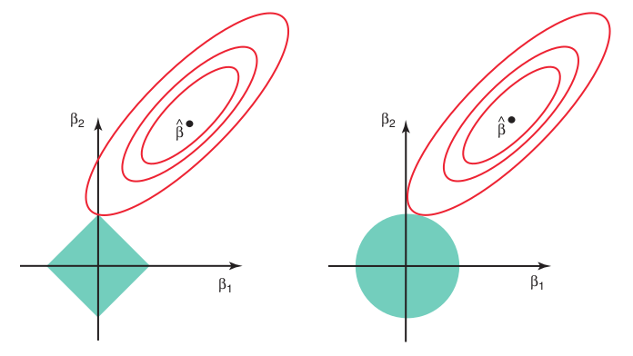

```{r setup, include=FALSE}
options(htmltools.dir.version = FALSE)
```

# caret

* Pacote do R!
* Criado pelo Max Kuhn (hoje no RStudio)


* Abreviação de _Classification And Regression Training_
* Primeira versão em 2007

---

# Motivação

* Cada pacote do R tem a sua forma de especificar o modelo
* Cada um também tem a sua forma de especificar predições
* É normal ter este tipo de inconsistências uma vez que são feitos por autores distintos

## Exemplo

Como pedir a estimativa da probabilidade em um modelo binário em diversas funções/pacotes:

* `lda` (MASS): `predict(obj)`
* `glm` (stats): `predict(obj, type = "response")`
* `gbm` (gbm): predict(obj, type = "response", n.trees)
* `rpart` (rpart): `predict(obj, type = "prob")`

---
class: center, middle

# caret

## Menor atrito cognitivo para ajustar muitos modelos


---

# caret

Inclui funções para:

* separação dos dados
* pré-processamento
* seleção de variáveis
* tuning de modelos e validação cruzada
* estimação de importância de variáveis

Todas criadas de forma padronizada.


---

# Alternativas

* `mlr`: [https://github.com/mlr-org/mlr](https://github.com/mlr-org/mlr)
* `parsnip`: [https://github.com/topepo/parsnip](https://github.com/topepo/parsnip) (em desenvolvimento)


* `scikit-learn`: [https://github.com/scikit-learn/scikit-learn](https://github.com/scikit-learn/scikit-learn) (python)

---

# [Recipes](https://tidymodels.github.io/recipes/)


* Para pré-processamento da base antes do treino do modelo
* Pode ser usado em conjunto com o `caret`!


---

# Regressão Linear

* $y \approx \hat{f}(x)$

* Minimizar $L(y, \hat{f}(x))$

* Em regressão fazemos: $\hat{f}(x) = \alpha + \beta_1*x_1 + \beta_2*x_2 + ... + \beta_p * x_p$

* Encontramos $\beta_1, \beta_2, ..., \beta_p$ que minimizam $L(y, \hat{f}(x))$.

---

# Regressão Logística

* $y \approx \hat{f}(x)$

* Minimizar $L(y, \hat{f}(x))$

* Não podemos usar isso: $\hat{f}(x) = \beta_0 + \beta_1*x_1 + \beta_2*x_2 + ... + \beta_p * x_p$

* Então usamos: 

$$\hat{f}(x) = \frac{1}{1 + e^{-( \beta_0 +  \beta_1*x_1 + \beta_2*x_2 + ... + \beta_p * x_p)}}$$

---

# Regressão Ridge

* $y \approx \hat{f}(x)$

* Normalmente minimizamos $L(y, \hat{f}(x))$

* Assumimos uma função dessa forma: $\hat{f}(x) = \beta_0 + \beta_1*x_1 + \beta_2*x_2 + ... + \beta_p * x_p$

* Para regularizar, minimizamos: $L(y, \hat{f}(x)) + \lambda(\beta_0^2 + \beta_1^2 + ... + \beta_p^2)$

* O que acontece quando $\lambda \longrightarrow 0$? E quando $\lambda \longrightarrow \infty$?

---

# Regressão LASSO

* $y \approx \hat{f}(x)$

* Normalmente minimizamos $L(y, \hat{f}(x))$

* Assumimos uma função dessa forma: $\hat{f}(x) = \beta_0 + \beta_1*x_1 + \beta_2*x_2 + ... + \beta_p * x_p$

* **Para regularizar**, minimizamos: $L(y, \hat{f}(x)) + \lambda(|\beta_0| + |\beta_1| + ... + |\beta_p|)$

* O que acontece quando $\lambda \longrightarrow 0$? E quando $\lambda \longrightarrow \infty$?

---

# Outra formulação

$$\underset{\beta}{\text{minimizar}}\left\{\sum_{i=1}^n \left(y_i - \beta_0 - \sum_{j=1}^p \beta_j x_{ij}\right)^2\right\} \text{ sujeito à } \sum_{j=1}^p \beta_j^2 \leq s \text{ ou } \sum_{j=1}^p |\beta_j| \leq s$$

```{r, echo=FALSE}

```

---

# Elastic Net

* $y \approx \hat{f}(x)$

* Normalmente minimizamos $L(y, \hat{f}(x))$

* Assumimos uma função dessa forma: $\hat{f}(x) = \beta_0 + \beta_1*x_1 + \beta_2*x_2 + ... + \beta_p * x_p$

* **Para regularizar**, minimizamos: 

$$L(y, \hat{f}(x)) + (1- \alpha)*\lambda(\alpha^2 + \beta_1^2 + ... + \beta_p^2) + \alpha* \lambda(|\beta_0| + |\beta_1| + ... + |\beta_p|)$$

- O que acontece quando $\alpha \longrightarrow 0$? E quando $\alpha \longrightarrow 1$?
- $\alpha$ é o *mixing parameter*.

---

# Bagging

* Pega A amostras com reposição da base de treino
* Para cada amostra "a"" em "A" treinamos um modelo
* No final fazemos a média das predições de todos os modelos


---

# Random Forest

* Considere que a base de treino possui $p$ variáveis
* Pega $A$ amostras com reposição da base de treino
* Para cada amostra $a$ em $A$ selecione aleatóriamente um conjunto de tamanho $m$ das variáveis. ($m < p$)
* Para cada amostra $a$ em $A$ treine uma árvore de decisão com as $m$ variáveis selecionadas.
* Combine todas as árvores fazendo a média das previsões individuais.
