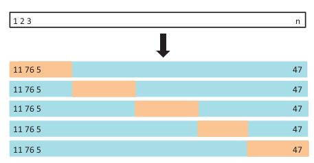

```{r setup, include=FALSE}
options(htmltools.dir.version = FALSE)

knitr::opts_chunk$set(
  echo = FALSE, 
  message = FALSE, 
  warning = FALSE,
  fig.width=6, 
  fig.height=6,
  fig.align='center'
)

library(tidyverse)
```

# Vamos falar de

- Intuição

- Viés e variância

- Erro de treino e erro de teste

- Validação cruzada

---

# Intuição


```{r echo=FALSE}
library(dplyr)
library(ggplot2)

n <- 10000

df <- data_frame(
  x1 = rnorm(n),
  x2 = rnorm(n),
  y = x2 > 0
)

ggplot(df, aes(x = x1, y= x2, color = y)) + geom_point(size = 0.1)
```


---

# Intuição (continuação)

```{r echo=FALSE}

n <- 10000
df <- data_frame(
  x1 = rnorm(n),
  x2 = rnorm(n),
  prob = 1/(1 + exp(3*x2)),
  y = rbinom(n, size = 1, prob = prob) == 1
)

ggplot(df, aes(x = x1, y= x2, color = y)) + geom_point(size = 0.1)
```

---

# Intuição (continuação)

```{r}
n <- 10000
df <- data_frame(
  x1 = rnorm(n),
  x2 = rnorm(n),
  prob = 1/(1 + exp(3*x1)),
  y = rbinom(n, size = 1, prob = prob) == 1
)

ggplot(df, aes(x = x1, y= x2, color = y)) + geom_point(size = 0.1)
```

---

# Intuição (continuação)

```{r}
n <- 10000
df <- data_frame(
  x1 = rnorm(n),
  x2 = rnorm(n),
  prob = 1/(1 + exp(2*x1 + 5*x2)),
  y = rbinom(n, size = 1, prob = prob) == 1
)

ggplot(df, aes(x = x1, y= x2, color = y)) + geom_point(size = 0.1)
```

---

# Intuição (continuação)

```{r}
n <- 10000
df <- data_frame(
  x1 = rnorm(n),
  x2 = rnorm(n),
  prob = 1/(1 + exp(5*x1 + 5*x2)),
  y = rbinom(n, size = 1, prob = prob) == 1
)

ggplot(df, aes(x = x1, y= x2, color = y)) + geom_point(size = 0.1)
```

---

# Estimando a performance

Para problemas de regressão:

* $R^2$
* Raíz do erro quadrático médio (RMSE)

$$RMSE = \frac{1}{n}\sum_{i=1}^n \big(y_i - \hat{f}(x_i)\big)^2$$

---

# Estimando a performance (cont)

Para problemas de classificação:

* Acurácia
* Kappa

$$Kappa = \frac{acurácia - p}{1 - p}$$
Onde $p$ é a taxa de resposta.

---

# Estimando a performance (cont)

* Área sobre a curva ROC.
* Sensibilidade: Taxa de verdadeiros positivos.
* Especificidade: Taxa de verdadeiros negativos. 


---

# Exemplo: 


- y: Cliente cancelou o cartão: Sim/Não

--


- x: variáveis que podem interferir no cancelamento

--

> Quantidade de compras no passado.

--

> Valor total gasto no passado.

--

> Tempo desde a sua primeira compra.

--

> ...

---

# Fontes de erro

$$y \approx \beta_0 + \beta_1 \text{qtd} + \beta_2 \text{valor} + \beta_3 \text{tempo} + \dots$$

--

Fontes de erro:

- Relação funcional entre $x$ e $y$

--

- Ausência de variáveis importantes para explicar $y$

--

- Erro de medida

--

- etc

--

<br>

- **Viés**: erro induzido por aproximar um fenômeno real, que pode pode ser extremamente complicado, por um modelo muito mais simples.


<!-- We would like our model to have minimum variance and minimum bias. But what we see in practice is that methods that reduce variance usually increases bias and vice-versa. -->

---

# Generalização

Será que o modelo ajustado será útil para estimar se um novo cliente irá cancelar o cartão?

--

- **Variância**: o quanto as estimativas dos parâmetros mudariam se nós os estimarmos usando uma base diferente. 

<br>

--

Trade-off: gostaríamos que nosso modelo tenha viés e variância mínimos, mas o que vemos na prática é que os métodos para redução da variância geralmente aumentam o viés e vice-versa.

---

# Exemplo

Vamos encontrar um bom modelo para ajustar esse conjunto de 10 pontos.

```{r}
set.seed(7)

dados <- data_frame(
  x = runif(10),
  y = 2*x + 3*x^2 + rnorm(10, 0, 0.15) 
)

dados2 <- data_frame(
  x = runif(100),
  y = 2*x + 3*x^2 + rnorm(100, 0, 0.1) 
)

modelo <- lm(y ~ x, data = dados)
modelo2 <- lm(y ~ poly(x, 2), data = dados)


ggplot(dados, aes(x = x, y = y)) + 
  geom_point() + 
  theme_bw()
```

---

# Exemplo

**Regressão linear simples**: $y = b_0 + b_1x + e$

```{r}
p <- ggplot(dados, aes(x = x, y = y)) + geom_point() + 
  geom_smooth(formula = y ~ x, colour = "red", se = FALSE, method = 'lm') +
  theme_bw()

p
```

---

# Exemplo

**Regressão linear simples**: $y = b_0 + b_1x + e$

```{r}
calcula_rmse <- function(modelo) {
  mean(residuals(modelo)^2) %>%
    sqrt() %>% 
    round(3)
}

rmse <- calcula_rmse(modelo) %>%
  str_c("RMSE: ", .)

p + geom_text(aes(x = 0.25, y = 4, label = rmse))
```

---

# Exemplo

**Modelo quadrático**: $y = b_0 + b_1x + b_2x^2 + e$

```{r, fig.align='center'}
rmse <- calcula_rmse(modelo2) %>%
  str_c("RMSE: ", .)


ggplot(dados, aes(x = x, y = y)) + geom_point() + 
  geom_smooth(formula = y ~ x, colour = "red", se = FALSE, method = 'lm') +
  geom_smooth(formula = y ~ poly(x, 2), colour = "orange", se = FALSE, method = 'lm') +
  geom_text(aes(x = 0.25, y = 4, label = rmse)) +
  theme_bw()
```

---

# Exemplo

```{r}
poly_lm <- function(dados, d) {
  lm(y ~ poly(x, degree = d, raw = TRUE), data = dados)
}

modelos <- map(1:9, poly_lm, dados = dados)
rmse <- 
  map(modelos, calcula_rmse) %>% 
  purrr::flatten_dbl()

tibble(`Grau do polinômio` = 1:9, RMSE = rmse) %>% 
  knitr::kable(format = "html", align = c("c", "c"))
```


---

# Exemplo

**Modelo polinomial de grau nove**: $y = b_0 + b_1x + b_2x^2 + \cdots + b_9x^9 + e$

```{r, fig.align='center'}
ggplot(dados, aes(x = x, y = y)) + geom_point() + 
  geom_smooth(formula = y ~ x, colour = "red", se = FALSE, method = 'lm') +
  geom_smooth(formula = y ~ poly(x, 2), colour = "orange", se = FALSE, method = 'lm') +
  geom_smooth(formula = y ~ poly(x, 9), colour = "blue", se = FALSE, method = 'lm') +
  theme_bw()
```

---
# Exemplo

E se nós obtermos mais dados? As curvas representam os modelos ajustados com os 10 pontos iniciais.

```{r, fig.align='center'}
ggplot(dados, aes(x = x, y = y)) + geom_point() + 
  geom_smooth(formula = y ~ x, colour = "red", se = FALSE, method = 'lm') +
  geom_smooth(formula = y ~ poly(x, 2), colour = "orange", se = FALSE, method = 'lm') +
  geom_smooth(formula = y ~ poly(x, 9), colour = "blue", se = FALSE, method = 'lm') +
  geom_point(data = dados2, aes(x = x, y = y)) +
  theme_bw()
```

---

# Exemplo

```{r}
calcula_rmse_newdata <- function(modelo, newdata) {
  mean((newdata$y - predict(modelo, newdata = newdata))^2) %>%
    sqrt() %>% 
    round(3)
}

rmse <- 
  map(modelos, calcula_rmse_newdata, newdata = dados2) %>% 
  purrr::flatten_dbl()

tibble(`Grau do polinômio` = 1:9, RMSE = rmse) %>% 
  knitr::kable(format = "html", align = c("c", "c"))
```

---

# Over-fitting

- Over-fitting ocorre quando o modelo absorve de forma inadequada comportamentos da amostra que não são generalizáveis para novas observações.

- No exemplo, uma escolha ruim do grau do polinômio está gerando over-fitting.

---

# Exemplo

Agora ajustando nos dados novos.

```{r, fig.align='center'}
ggplot(dados2, aes(x = x, y = y)) + geom_point() + 
  geom_smooth(formula = y ~ x, colour = "red", se = FALSE, method = 'lm') +
  geom_smooth(formula = y ~ poly(x, 2), colour = "orange", se = FALSE, method = 'lm') +
  geom_smooth(formula = y ~ poly(x, 9), colour = "blue", se = FALSE, method = 'lm') +
  theme_bw()
```

---

# Exemplo

```{r}
modelos <- map(1:9, poly_lm, dados = dados2)
rmse <- 
  map(modelos, calcula_rmse) %>% 
  purrr::flatten_dbl()

tibble(`Grau do polinômio` = 1:9, RMSE = rmse) %>% 
  knitr::kable(format = "html", align = c("c", "c"))
```

---

# Estimando a performance do modelo

Como estimar o viés e a variância do modelo?

--

- **Erro de treino**: é o erro encontrado ao aplicar o modelo na própria base utilizada para treiná-lo.

- **Erro de teste**: é o erro encontrado ao aplicar o modelo a uma base não utilizada no treino.

---

# Separação da base

- **base de treino**: observações utilizadas para estimar os parâmetros do modelo e determinar os parâmetros de complexidade (hiperparâmetros)

- **base de teste**: observações utilizadas para estimar o erro de teste. Essas observações não devem ser usadas para treinar o modelo.

--

- Muitas observações na base de treino vão levar a estimativas mais precisas para os parâmetros, mas não teremos uma boa estimativa da performance do modelo.

- Muitas observações na base de teste não vão permitir termos boas estimativas dos parâmetros.

---

# Selecionando hiperparâmetros

E como fazemos para determinar os parâmetros de complexidade?

--

**Validação cruzada**: método para estimar o erro preditivo de um modelo utilizando reamostragem.

--

- Leave-one-out cross-validation (LOOCV)
- K-fold cross-validation

---

# LOOCV

```{r}
knitr::include_graphics("img/loocv.png")
```

---

# k-fold

```{r}

```

---

# Atenção especial quando o tempo está envolvido.


